# berkeley-ai-search
 Berkeley AI Project 1 : Search

 These are my answers to the UC Berkeley CS188 Intro to AI Project 1 : Search. Starter code and resources can be found at their website http://ai.berkeley.edu/search.html.

 In this project I implement different search algorithms (listed below), and utilize them to solve various problems within the game of pacman.

  - Depth First Search
  - Breadth First Search
  - Uniform Cost Search
  - A* Search (Including different heuristics to solve certain problems)

## Project Questions
- [Q1: Depth First Search](#q1-depth-first-search)
- [Q2: Breadth First Search](#q2-breadth-first-search)
- [Q3: Uniform Cost Search](#q3-uniform-cost-search)
- [Q4: A* Search](#q4-a-search)
- [Q5: Corners Problem: Representation](#q5-corners-problem-representation)
- [Q6: Corners Problem: Heuristic](#q6-corners-problem-heuristic)
- [Q7: Eating All The Dots: Heuristic](#q7-eating-all-the-dots-heuristic)
- [Q8: Suboptimal Search](#q8-suboptimal-search)

## Reflection
- [Built with](#built-with)
- [What I learned](#what-i-learned)
- [Author](#author)

## Q1: Depth First Search

  ***Implement the depth-first search (DFS) algorithm in the depthFirstSearch function in search.py. To make your algorithm complete, write the graph search version of DFS, which avoids expanding any already visited states.***

  In this problem I had to implement the DFS algorithm to solve pacman tinyMaze, mediumMaze, and bigMaze.

  The key to implementing a Depth First Search, in contrast to a Breadth First Search, is to utilize the LIFO(last in first out) capabilites of the stack.

  The algorithm below will start by expanding on the start node and push its neighbors on to the stack. The states popped off the stack will always be from the most recently expanded state thus it searches the states prioritizing depth rather than breadth.

  ```python

  def depthFirstSearch(problem):
  """
  Search the deepest nodes in the search tree first.

  Your search algorithm needs to return a list of actions that reaches the
  goal. Make sure to implement a graph search algorithm.

  To get started, you might want to try some of these simple commands to
  understand the search problem that is being passed in:

  print "Start:", problem.getStartState()
  print "Is the start a goal?", problem.isGoalState(problem.getStartState())
  print "Start's successors:", problem.getSuccessors(problem.getStartState())
  """
  "*** YOUR CODE HERE ***"

  # Implement the stack
  stack = util.Stack()
  visited = {}

  # Push the start state onto the stack
  start = problem.getStartState()
  stack.push((start, []))

  # While there are states still left to expand
  while not stack.isEmpty():

      # Pop the most recent state off the stack and visit it
      state, path = stack.pop()
      visited[state] = True

      # If the state is the goal return the path
      if problem.isGoalState(state):
          return path

      # Otherwise expand the state
      successors = problem.getSuccessors(state)

      # Add its neighbors onto the stack, while updating the path
      for s in successors:
          if s[0] not in visited:
              stack.push((s[0], path + [s[1]]))

  # No path found, return an empty path
  return []
  
  ```

  After implementing the algorithm I tested it on the mazes below. As a note for future mazes : The brighter the red is on the maze, the earlier that space was expanded in the algorithm.

  ```
  python pacman.py -l tinyMaze -p SearchAgent
  ```

  

  In this example DFS did not find the optimal solution because it prioritized expanding towards the left first and wrapping around. It reaches the goal state at the very end and as a result the algorithm returns a path from the left.

  ```
  python pacman.py -l mediumMaze -p SearchAgent
  ```
  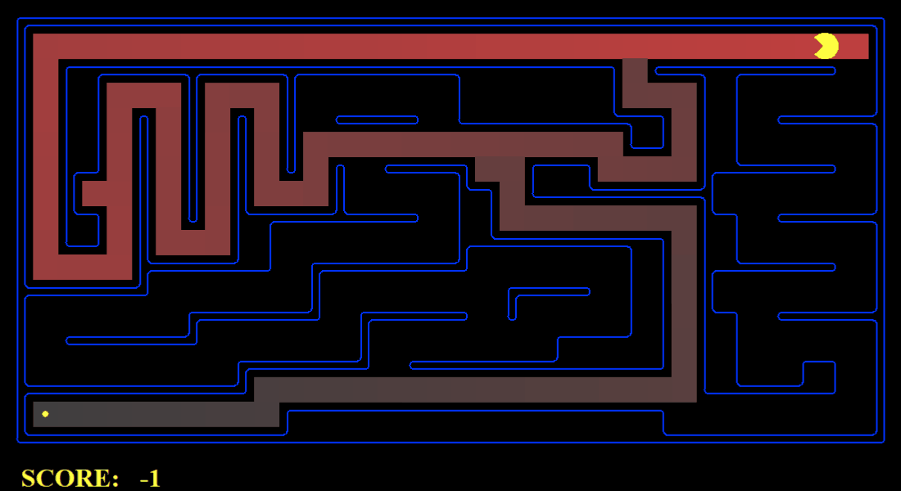

  Again in this maze example DFS did not find the optimal solution because it prioritized expanding towards the left first. That being the case the algorithm built the path from the states from the left so when it found the goal state the path it took was from the left.

  ```
  python pacman.py -l bigMaze -z .5 -p SearchAgent
  ```

  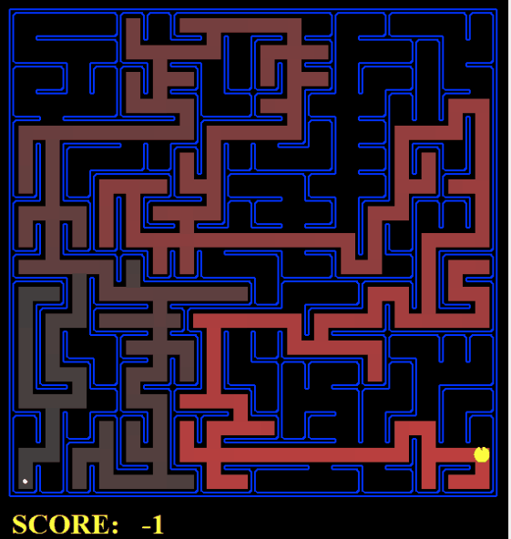

  In this situation the algorithm found the optimal solution to the maze.


  Everything seemed to work as expected so finally I ran it throught the autograder as a final check.

  ```
  python autograder.py -q q1
  ```

  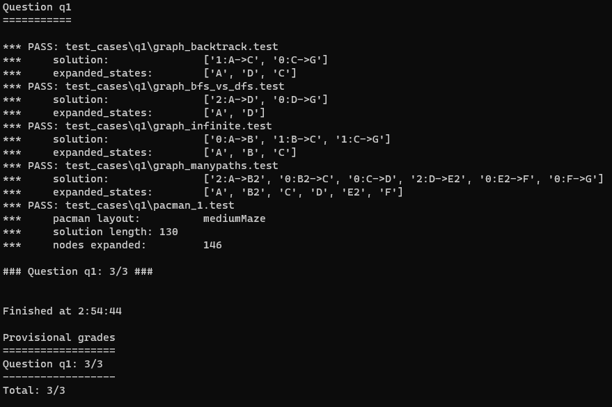

## Q2: Breadth First Search

  ***Implement the breadth-first search (BFS) algorithm in the breadthFirstSearch function in search.py. Again, write a graph search algorithm that avoids expanding any already visited states. Test your code the same way you did for depth-first search.***

  In this problem I had to implement the Breadth First Search algorithm. The problem similar to the first one requires a specific data structure. This time we use a FIFO(First in First Out) data structure known as a queue.

  As we start expanding out from the start state, the algorithm will pop states from the queue that entered the queue first. It will prioritize searching states are shallow within the maze thus it searches in breadth rather than depth.

  ```python
  def breadthFirstSearch(problem):
    """Search the shallowest nodes in the search tree first."""
    "*** YOUR CODE HERE ***"
    # Implement the queue
    queue = util.Queue()
    visited = []

    # Push the start state onto the queue
    start = problem.getStartState()
    queue.push((start, []))

    # While there are states still left to expand
    while not queue.isEmpty():

        # Pop the next state off the queue and visit it
        state, path = queue.pop()
        visited.append(state)

        # If the state is the goal return the path
        if problem.isGoalState(state):
            return path

        # Otherwise expand the state
        successors = problem.getSuccessors(state)

        # Add its neighors onto the queue, while updating the path if the node hasn't already been visited and its not in queue already.
        for s in successors:
            if s[0] not in visited and s[0] not in (state[0] for state in queue.list):
                queue.push((s[0], path + [s[1]]))

    # No path found, return an empty path
    return []
  ```

  Thing to note in this algorithm is that we changed the data structure from a stack to a queue. This as mentioned above is key to implementing BFS. Also we added to the line just before we push a state to the queue that checks if the node is in the queue. If the node is already in the queue that means there is a path that already exists to that node that is faster than the one we could add to the queue. We prevent this from happening so that the state isnt expanded multiple times, preventing the algorithm from finding a valid path.

  After implementing the algorithm I tested it on the mazes below.

  ```
  python pacman.py -l mediumMaze -p SearchAgent -a fn=bfs
  ```

  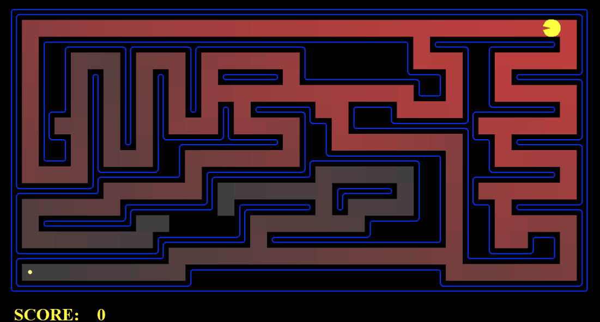

  BFS was able to find the optimal path in contrast to DFS. This was due to BFS building paths from shallow states thus it was able to see the path.

  ```
  python pacman.py -l bigMaze -p SearchAgent -a fn=bfs -z .5
  ```

  Similar to DFS, BFS was able to find the optimal path to the Big Maze as well.

  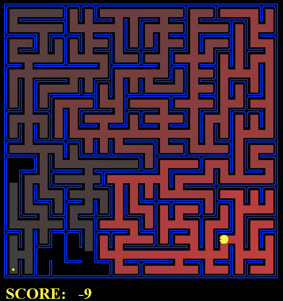

  Again I ran the autograder.

  ```
  python autograder.py -q q2
  ```

  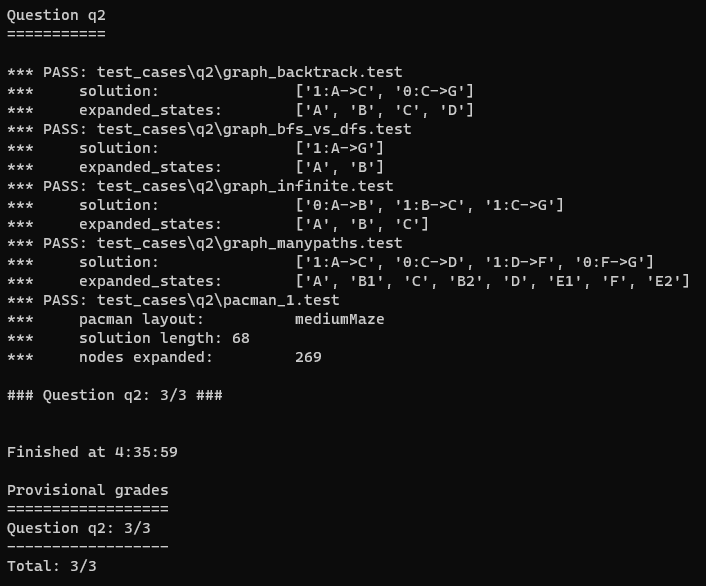
  

## Q3: Uniform Cost Search

  ***Implement the uniform-cost graph search algorithm in the uniformCostSearch function in search.py. We encourage you to look through util.py for some data structures that may be useful in your implementation. You should now observe successful behavior in all three of the following layouts, where the agents below are all UCS agents that differ only in the cost function they use (the agents and cost functions are written for you):***

  In contrast to DFS which searches deep states first and BFS which searches shallow states first, Uniform Cost Search will search states based on the cost of the move. For example if there is a dot in a state for pacman to eat the algorithm will prioritize going to that state rather than to an empty space. In doing this we can prioritize going to certain paths that may increase the score or avoid paths that may get pacman eaten by ghosts.

  ```python
  def uniformCostSearch(problem):
      """Search the node of least total cost first."""
      "*** YOUR CODE HERE ***"
      # Implement the priority queue
      pqueue = util.PriorityQueue()
      visited = {}

      # Store the path
      path = []

      # Push the start state onto the queue with priority of 0
      start = problem.getStartState()
      pqueue.push((start,[]), 0)

      # While there are states still left to expand
      while not pqueue.isEmpty():

          # Pop the next state off the queue and visit it
          state, path = pqueue.pop()
          visited[state] = True

          # If the state is the goal return the path
          if problem.isGoalState(state):
              return path
          
          # Otherwise expand the state
          successors = problem.getSuccessors(state)

          # Add its neighors onto the queue
          for s in successors:

              # If the state isn't visited and doesn't exist in the queue
              if s[0] not in visited and s[0] not in (state[2][0] for state in pqueue.heap):

                  # Add it to the path, get the cost of the state, and push it onto the queue
                  newPath = path + [s[1]]
                  pri = problem.getCostOfActions(newPath)
                  pqueue.push((s[0], newPath), pri)

              # Else if the state isn't visited but exists in the queue
              elif s[0] not in visited and s[0] in (state[2][0] for state in pqueue.heap):

                  # Find the state in the queue
                  for hstate in pqueue.heap:
                      if hstate[2][0] == s[0]:

                          # If the old cost is greater than the new cost push the state onto the queue with the new cost
                          oldPri = problem.getCostOfActions(hstate[2][1])
                          newPri = problem.getCostOfActions(path + [s[1]])
                          if oldPri > newPri:
                              pqueue.push((s[0], (path + [s[1]])), s[2])
                              
      # No path found, return an empty path
      return []
  ```
  The algorithm behaves like BFS in the sense that we implement a queue. However everytime we push a state on the queue, we also push a cost. The priority queue will push states that have a lower cost first. The rest of the code is similar to BFS except that we also check the queue for states that have a greater cost. If there exists a path with a lower cost than one in the priority queue then it will push that other path into the queue. As a result that new path will be expanded first before the one with the greater cost thus if there is a path that leads to the goal state it will be created using the lower cost path.

  ```
  python pacman.py -l mediumMaze -p SearchAgent -a fn=ucs
  ```

  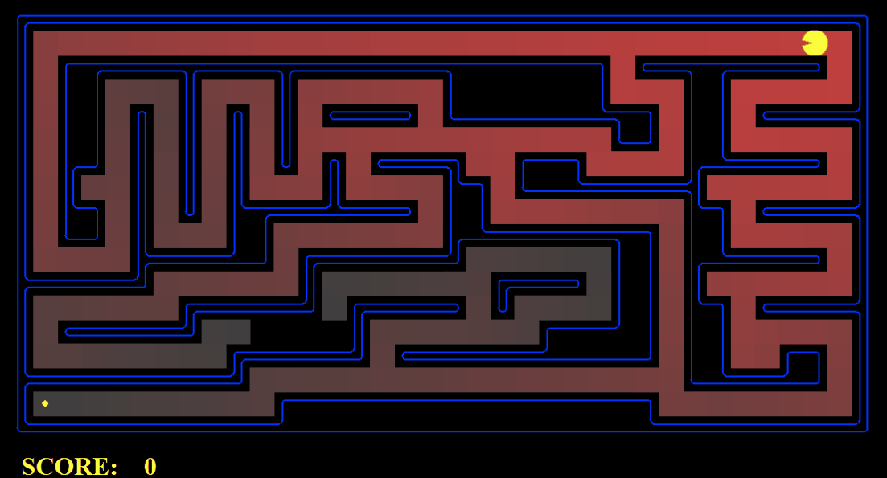

  Similar to BFS, UCS found the optimal path and did so by searching the path with the lowest cost, which also happens to be the path shortest to the goal.

  ```
  python pacman.py -l mediumDottedMaze -p StayEastSearchAgent
  ```

  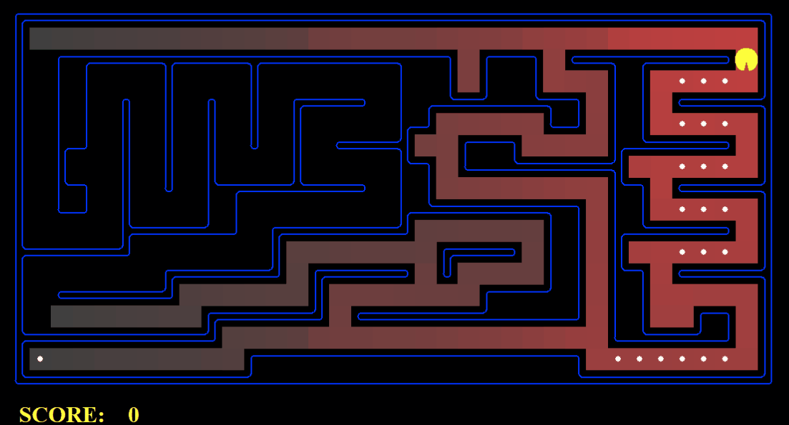

  In this maze, UCS takes a different path than before because it is prioritizing the dots. The dots increase the score achieved in the game therefore it takes a less optimal path to achieve a higher score.

  ```
  python pacman.py -l mediumScaryMaze -p StayWestSearchAgent
  ```

  Lastly in this maze it takes the least optimal path to the goal state, like in DFS, however it does so to avoid getting eaten by the ghosts which would end with a lower score than the least optimal solution here.

  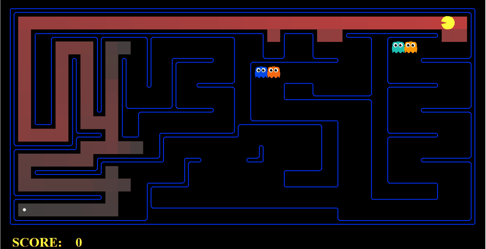

  Again I ran the autograder.

  ```
  python autograder.py -q q3
  ```

  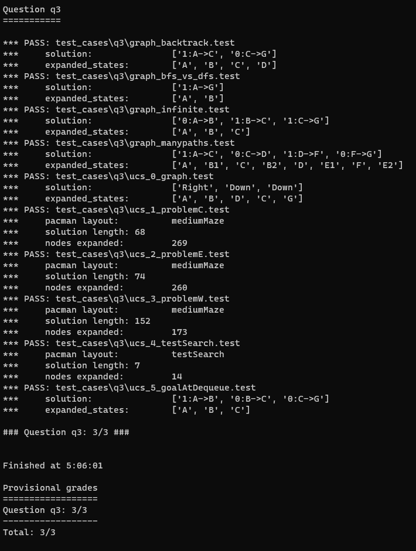

## Q4: A* Search

  ***Implement A\* graph search in the empty function aStarSearch in search.py. A\* takes a heuristic function as an argument. Heuristics take two arguments: a state in the search problem (the main argument), and the problem itself (for reference information). The nullHeuristic heuristic function in search.py is a trivial example.***

  The effectiveness of A* Search depends a lot on how good the heuristic is for the search. In cases where the heurisitic is very good, A* Search is usually the most optimal search method.

  ```python
  def aStarSearch(problem, heuristic=nullHeuristic):
      """Search the node that has the lowest combined cost and heuristic first."""
      "*** YOUR CODE HERE ***"

      # Implement the priority queue
      pqueue = util.PriorityQueue()
      visited = {}

      # Store the path here
      path = []

      # Push the start state onto the queue with priority 0 + the cost of the heuristic
      start = problem.getStartState()
      pqueue.push((start,[]), 0 + heuristic(start, problem))

      # While there are states still left to expand
      while not pqueue.isEmpty():

          # Pop the next state off the queue and visit it
          state, path = pqueue.pop()
          visited[state] = True

          # If the state is the goal return the path
          if problem.isGoalState(state):
              return path
          
          # Otherwise expand the state
          successors = problem.getSuccessors(state)

          # Add its neighors onto the queue
          for s in successors:

              # If the state isn't visited and doesn't exist in the queue
              if s[0] not in visited and s[0] not in (state[2][0] for state in pqueue.heap):
                  newPath = path + [s[1]]
                  pri = problem.getCostOfActions(newPath)
                  pqueue.push((s[0], newPath), pri + heuristic(s[0], problem))

              # Else if the state isn't visited but exists in the queue
              elif s[0] not in visited and s[0] in (state[2][0] for state in pqueue.heap):
                  for hstate in pqueue.heap:
                      if hstate[2][0] == s[0]:

                          # If the old cost is greater than the new cost push the state onto the queue with the new cost
                          oldPri = problem.getCostOfActions(hstate[2][1])
                          newPri = problem.getCostOfActions(path + [s[1]])
                          if oldPri > newPri:
                              pqueue.push((s[0], (path + [s[1]])), newPri + heuristic(s[0], problem))

      # No path found, return an empty path
      return []
  ```

  The construction of the algorithm is similar to that of UCS with the addition of the heuristic function that adds to the cost of the state in the priority queue. In this problem we were given a manhattan distance heuristic which calculates the distance of the state from the goal state. Closer states to the goal will have a lower cost and thus be searched first in the priority queue.

  ```
  python pacman.py -l bigMaze -z .5 -p SearchAgent -a fn=astar,heuristic=manhattanHeuristic
  ```
  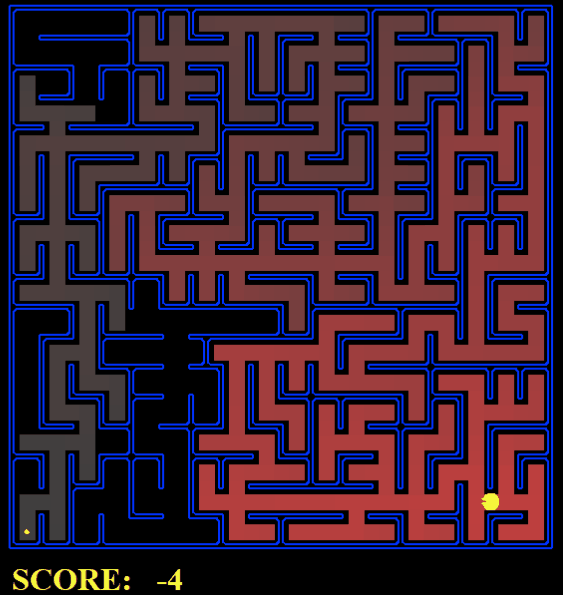

  Using A* Search we were also able to find the optimal solution to the big maze.

  Again I ran the autograder.

  ```
  python autograder.py -q q4
  ```

  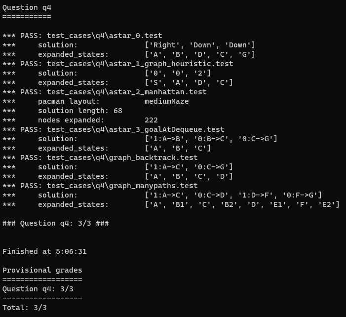

## Q5: Corners Problem: Representation

  ***Implement the CornersProblem search problem in searchAgents.py. You will need to choose a state representation that encodes all the information necessary to detect whether all four corners have been reached. Now, your search agent should solve:***

  For this problem we had to create an underlying state that would aid in solving a maze by touching every corner.

  ```python
  class CornersProblem(search.SearchProblem):
    """
    This search problem finds paths through all four corners of a layout.

    You must select a suitable state space and successor function
    """

    def __init__(self, startingGameState):
        """
        Stores the walls, pacman's starting position and corners.
        """
        self.walls = startingGameState.getWalls()
        self.startingPosition = startingGameState.getPacmanPosition()
        top, right = self.walls.height-2, self.walls.width-2
        self.corners = ((1,1), (1,top), (right, 1), (right, top))
        for corner in self.corners:
            if not startingGameState.hasFood(*corner):
                print 'Warning: no food in corner ' + str(corner)
        self._expanded = 0 # DO NOT CHANGE; Number of search nodes expanded
        # Please add any code here which you would like to use
        # in initializing the problem
        "*** YOUR CODE HERE ***"

        # State used to determine if all corners have been visited
        self.initialState = [0,0,0,0]

    def getStartState(self):
        """
        Returns the start state (in your state space, not the full Pacman state
        space)
        """
        "*** YOUR CODE HERE ***"

        # Returns the start state and the state of the corners
        return (self.startingPosition, self.initialState)

    def isGoalState(self, state):
        """
        Returns whether this search state is a goal state of the problem.
        """
        "*** YOUR CODE HERE ***"

        # If all the corners haven't been visited, or are 0, return False
        for corner in state[1]:
            if corner == 0:
                return False
            
        return True

        

    def getSuccessors(self, state):
        """
        Returns successor states, the actions they require, and a cost of 1.

         As noted in search.py:
            For a given state, this should return a list of triples, (successor,
            action, stepCost), where 'successor' is a successor to the current
            state, 'action' is the action required to get there, and 'stepCost'
            is the incremental cost of expanding to that successor
        """

        successors = []
        for action in [Directions.NORTH, Directions.SOUTH, Directions.EAST, Directions.WEST]:
            # Add a successor state to the successor list if the action is legal
            # Here's a code snippet for figuring out whether a new position hits a wall:
            #   x,y = currentPosition
            #   dx, dy = Actions.directionToVector(action)
            #   nextx, nexty = int(x + dx), int(y + dy)
            #   hitsWall = self.walls[nextx][nexty]

            "*** YOUR CODE HERE ***"

            # Retrieve the state being expanded and a shallow copy of the corners
            x,y = state[0]
            corner = state[1][:]

            # Get the position of the successor states neighboring the expanded state
            dx, dy = Actions.directionToVector(action)
            nextx, nexty = int(x + dx), int(y + dy)

            # If the position isnt located in a wall
            if not self.walls[nextx][nexty]:
                
                # If the position is a corner update the corner as visited
                if (nextx, nexty) in self.corners:
                    corner[self.corners.index((nextx, nexty))] = 1

                # Construct the state
                nextState = ((nextx, nexty), corner)
                cost = 1

                # Append the state as a successor
                successors.append((nextState, action, cost))
        
        # Update the number of expanded states and return the successors
        self._expanded += 1 # DO NOT CHANGE
        return successors
  ```

  To solve this problem we implemented a list of the four corners and set their state to 0. To start off we created a start state which is just the position of pacman at the start and the list of the corners. When the algorithm expands the states we check each neighboring state to see if its a corner and if it is we update the list of corners with that information.  When all the corners are visited, or 1, then we have succeeded and are at the goal state.

  ```
  python pacman.py -l tinyCorners -p SearchAgent -a fn=bfs,prob=CornersProblem
  ```
  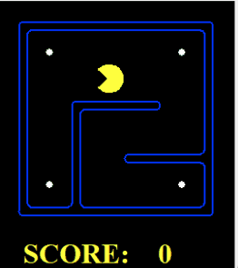

  Here the algorithm solves the corner problem in the tiny maze.

  ```
  python pacman.py -l mediumCorners -p SearchAgent -a fn=bfs,prob=CornersProblem
  ```

  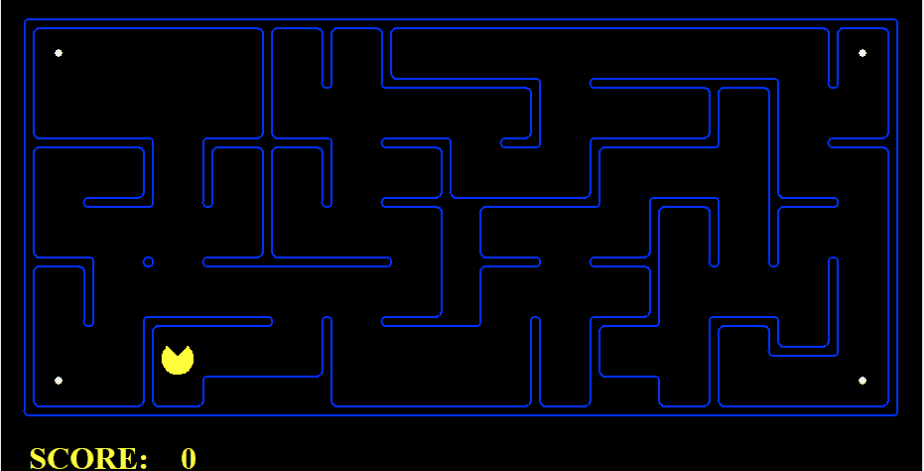

  Here the algorithm solves the corner problem in the medium maze.

  Again I ran the autograder.

  ```
  python autograder.py -q q5
  ```

  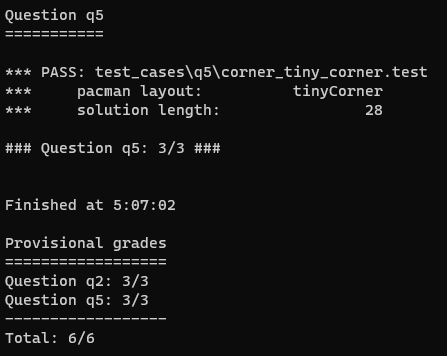

## Q6: Corners Problem: Heuristic

***Implement a non-trivial, consistent heuristic for the CornersProblem in cornersHeuristic.***

## Q7: Eating All The Dots: Heuristic

***Now we'll solve a hard search problem: eating all the Pacman food in as few steps as possible. For this, we'll need a new search problem definition which formalizes the food-clearing problem: FoodSearchProblem in searchAgents.py (implemented for you). A solution is defined to be a path that collects all of the food in the Pacman world. For the present project, solutions do not take into account any ghosts or power pellets; solutions only depend on the placement of walls, regular food and Pacman. (Of course ghosts can ruin the execution of a solution! We'll get to that in the next project.) If you have written your general search methods correctly, A* with a null heuristic (equivalent to uniform-cost search) should quickly find an optimal solution to testSearch with no code change on your part (total cost of 7).***

## Q8: Suboptimal Search
***Sometimes, even with A* and a good heuristic, finding the optimal path through all the dots is hard. In these cases, we'd still like to find a reasonably good path, quickly. In this section, you'll write an agent that always greedily eats the closest dot. ClosestDotSearchAgent is implemented for you in searchAgents.py, but it's missing a key function that finds a path to the closest dot.***

***Implement the function findPathToClosestDot in searchAgents.py. Our agent solves this maze (suboptimally!) in under a second with a path cost of 350:***

## Built With

This project was built using the code provided by UC Berkeley CS188 Intro to AI at http://ai.berkeley.edu/search.html.
The project uses Python 2.7.

## What I learned

## Author